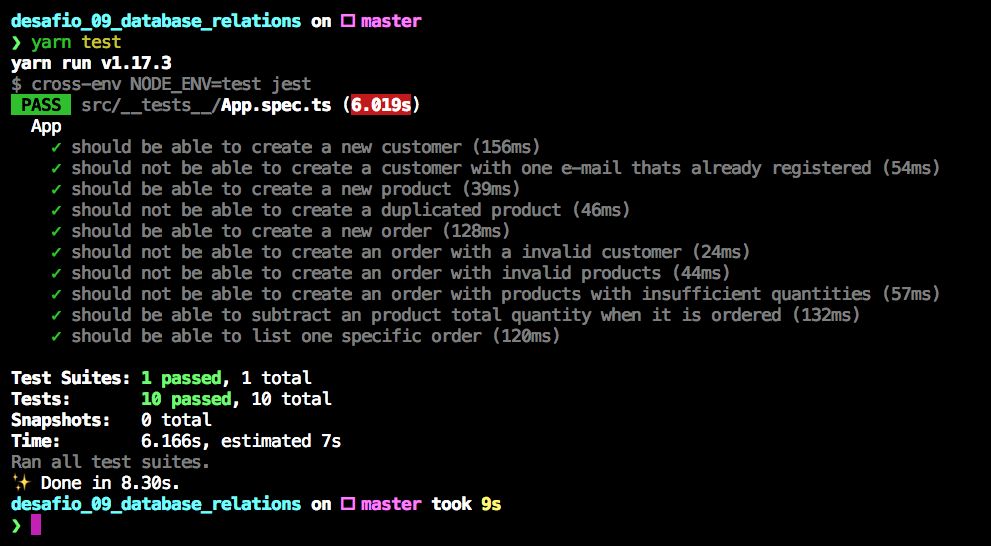

<h3 align="center">
  Desafio 09: Database Relations
</h3>

“Não espere resultados brilhantes se suas metas não forem claras”!</blockquote>

  

  

  

  <a href="#rocket-sobre-o-desafio">Sobre o desafio</a>&nbsp;&nbsp;&nbsp;|&nbsp;&nbsp;&nbsp;
  <a href="#memo-licença">Licença</a>

## :rocket: Sobre o desafio

Essa é uma API contruída em Node js com Typescript, nela é possível fazer o cadastro de produtos com a respectiva quantidade de estoque, reservar os produtos para a venda e validar as quantidades e produtor existentes.

## :calendar: Entrega

Esse desafio foi entregue a partir da plataforma Skylab!

## :memo: Licença

Esse projeto está sob a licença MIT. Veja o arquivo [LICENSE](LICENSE) para mais detalhes.

---

Feito com 💜 by Carlos
